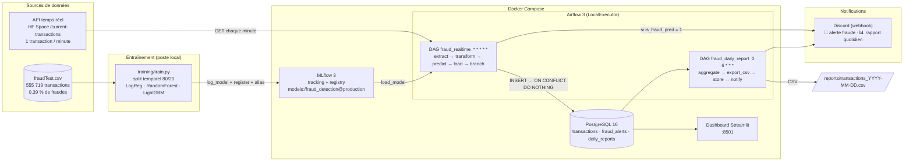

# Architecture — Automatic Fraud Detection

> Livrable 1 du projet Jedha *ETL with Airflow* : schéma de l'infrastructure et justification des choix.

## 1. Besoins et contraintes

| Besoin métier | Réponse technique |
|---|---|
| **Être notifié dès qu'une fraude est détectée** | DAG Airflow cadencé **à la minute** : API → prédiction → base → alerte Discord (< 30 s après réception) |
| **Chaque matin, consulter les paiements et fraudes de la veille** | DAG Airflow quotidien à **6h (Europe/Paris)** : agrégats J-1 → rapport Discord + export CSV + historisation ; dashboard Streamlit pour l'exploration |

Contraintes minimales de l'énoncé : un élément qui **collecte & stocke**, un élément qui **consomme** (le modèle), un **processus ETL** orchestré — et la priorité au pipeline de données plutôt qu'à l'algorithme.

## 2. Schéma



Le package Python **`src/fraud_detection/`** (features, client API, DB, modèle, notifications) est partagé entre l'entraînement et les DAGs : le pipeline sklearn loggé dans MLflow embarque le `FeatureBuilder`, donc **une ligne brute de l'API traverse exactement les mêmes transformations qu'une ligne du CSV d'entraînement**.

## 3. Composants et rôle

| # | Composant | Rôle | Techno | Port |
|---|---|---|---|---|
| 1 | **Training** | Feature engineering, comparaison de 3 algorithmes, enregistrement du meilleur | Python, pandas, scikit-learn, LightGBM | — |
| 2 | **MLflow** | Tracking des runs (params, métriques, artefacts), **registry** avec alias `production` | MLflow 3.16 server, backend PostgreSQL, artefacts sur volume | 5000 |
| 3 | **Airflow** | Orchestration ETL : DAG temps réel + DAG quotidien | Apache Airflow 3.3, LocalExecutor, FAB auth | 8080 |
| 4 | **PostgreSQL** | Data warehouse : transactions brutes + prédictions, alertes envoyées, rapports | PostgreSQL 16 (une instance, bases `airflow`, `mlflow`, `fraud`) | 5432 |
| 5 | **Notification** | Alerte immédiate + rapport du matin | Webhook Discord (embeds) | — |
| 6 | **Dashboard** | Exploration par journée, qualité du modèle en live | Streamlit + Plotly | 8501 |

### DAG `fraud_realtime` (chaque minute)

1. `extract` — appel de l'API ; le JSON est **double-encodé** (string JSON dans du JSON, format pandas `split`), décodé dans `api_client.py`.
2. `transform` — normalisation : noms de colonnes de la table, `current_time` (epoch ms) → `trans_time` UTC.
3. `predict` — chargement de `models:/fraud_detection@production` depuis le registry (≈ 2 s), `predict_proba`, seuil `FRAUD_THRESHOLD` (0,5). Un paramètre de run `threshold_override` permet de forcer une alerte pour la démo.
4. `load` — `INSERT … ON CONFLICT (trans_num) DO NOTHING RETURNING` : **dédoublonnage** (l'API peut renvoyer la même transaction plusieurs minutes de suite) ; seules les lignes réellement nouvelles continuent.
5. `check_fraud` (branche) → `alert` (Discord + trace dans `fraud_alerts`) ou `no_fraud`.

Garde-fous : `max_active_runs=1`, `catchup=False`, 2 retries sur l'API, `dagrun_timeout` 5 min, l'échec d'un envoi Discord est tracé (`status=failed`) sans casser le stockage.

### DAG `fraud_daily_report` (6h Europe/Paris)

`aggregate` (SQL : volumes, montants, top catégories/états, répartition horaire, précision/rappel live) → `export_csv` (`reports/`) → `store` (`daily_reports`, payload JSONB) → `notify` (embed Discord). Paramètre `report_date` pour rejouer une journée.

## 4. Modèle

- **Features** (calculées par `FeatureBuilder`, partagé) : `amt`, `city_pop`, `hour`, `day_of_week`, `age` (depuis `dob`), `distance_km` client ↔ marchand (haversine), `category` et `gender` (one-hot). Identifiants et PII (`cc_num`, noms, adresse, `trans_num`, `merchant`, `job`) exclus.
- **Déséquilibre** (0,39 % de fraudes) : `class_weight` / `scale_pos_weight`, évaluation sur **PR-AUC** (l'accuracy serait trompeuse à 99,6 %).
- **Split temporel** 80/20 : on entraîne sur le passé et on teste sur le futur, comme en production.

| Modèle | PR-AUC | ROC-AUC | Précision @0,5 | Rappel @0,5 |
|---|---|---|---|---|
| Régression logistique | 0,049 | 0,904 | 0,011 | 0,734 |
| **RandomForest** (retenu) | **0,805** | 0,994 | 0,867 | 0,707 |
| LightGBM | 0,735 | 0,989 | 0,626 | 0,701 |

Le RandomForest est enregistré dans le registry (`fraud_detection` v1, alias `production`). Changer de modèle = ré-entraîner et déplacer l'alias ; **aucune modification des DAGs**.

Limite connue : l'API temps réel rejoue des transactions du même dataset (elle renvoie d'ailleurs `is_fraud`) — le modèle en a vu une partie à l'entraînement. Le label est stocké comme vérité terrain (`is_fraud_truth`) et jamais utilisé pour prédire ; il sert au suivi de la qualité en live (précision/rappel dans le rapport et le dashboard).

## 5. Pourquoi cette architecture

| Choix | Alternative écartée | Justification |
|---|---|---|
| **Airflow seul pour l'ingestion** (DAG à la minute) | Kafka + producer/consumer | L'API ne produit **qu'une transaction par minute** : un bus de streaming serait surdimensionné (2 services de plus, code hors orchestrateur, débogage plus lourd) pour une latence identique. Kafka reste l'évolution naturelle si le débit monte (voir §6). |
| **Modèle chargé depuis le registry MLflow** dans la tâche `predict` | API FastAPI de scoring | Aucun service supplémentaire, pas de réseau à sécuriser ; l'alias `production` découple totalement entraînement et exploitation. Une API devient utile seulement si d'autres clients doivent scorer. |
| **Pipeline sklearn complet loggé** (preprocessing inclus) | Sauver le classifieur seul | Exigence de réutilisabilité de l'énoncé : `.predict()` sur une ligne brute, sans dupliquer le preprocessing côté Airflow. |
| **PostgreSQL** comme warehouse | Fichiers, NoSQL, S3 | Source unique de vérité relationnelle pour le temps réel, le rapport et le dashboard ; dédoublonnage par clé primaire ; requêtes d'agrégation simples. Une seule instance héberge aussi les métadonnées Airflow et MLflow. |
| **Discord webhook** | E-mail SMTP, Zapier | 5 lignes de code, gratuit, message riche (embed), visuel pour la démo ; le métier « a juste besoin d'une notification ». |
| **Docker Compose** | Cloud (Neon, HF Space, EC2) | Reproductible en une commande, zéro coût, tout démontrable depuis le poste. Chaque brique est conteneurisée donc déployable telle quelle. |
| **Airflow 3** | Airflow 2 | Version courante (Task SDK, API server) ; 2.x en fin de vie. |

## 6. Évolutions possibles

- **Débit plus élevé** : remplacer `extract` par un producer Kafka et le DAG par un consumer streaming ; Airflow garde le batch quotidien et le ré-entraînement.
- **Ré-entraînement planifié** : un DAG hebdomadaire qui relance `train.py` sur les transactions accumulées (avec `is_fraud_truth`) et promeut la nouvelle version si la PR-AUC s'améliore.
- **Déploiement cloud** : PostgreSQL managé (Neon/RDS), MLflow sur un Space HF ou une VM, Airflow sur une VM/Astronomer, artefacts MLflow sur S3.
- **Canaux supplémentaires** : e-mail (`EmailOperator`) ou SMS pour les fraudes à gros montant.

## 7. Arborescence

```
airflow/dags/            fraud_realtime_dag.py · fraud_daily_report_dag.py
airflow/Dockerfile       image Airflow + deps ML (versions alignées avec pyproject.toml)
src/fraud_detection/     config · features · api_client · model · db · notify
training/train.py        entraînement + log MLflow + registry
mlflow/Dockerfile        serveur MLflow (backend Postgres)
dashboard/               app Streamlit
sql/init.sql             schéma de la base fraud
docker/dev/              docker-compose.yml + init PostgreSQL
tests/                   13 tests unitaires (features, parsing API, notifications, config)
docs/                    ce document + script de démo
```
