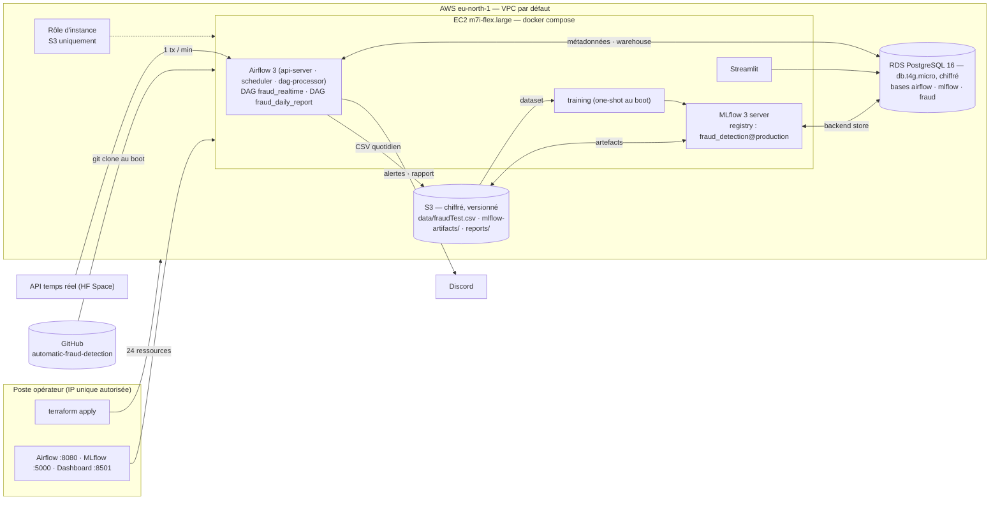

# Déploiement en production (AWS)

> Le pipeline tourne dans le cloud : infrastructure déclarée en **Terraform**, orchestration **Airflow 3**,
> base **RDS PostgreSQL** managée, dataset / artefacts MLflow / rapports dans **S3**. Ce document décrit
> ce qui est déployé, comment le reproduire, et ce qui diffère de la stack de développement.

- Infrastructure : [`infra/terraform/`](../infra/terraform/) (`main.tf`, `variables.tf`, `outputs.tf`, `user_data.sh`, `tf.sh`)
- Stack : [`docker/prod/docker-compose.yml`](../docker/prod/docker-compose.yml)
- Région : **eu-north-1 (Stockholm)** — résidence des données UE

---

## 1. Architecture déployée



| Brique | Développement (`docker/dev/`) | Production (`docker/prod/` + Terraform) |
|---|---|---|
| PostgreSQL | conteneur, 3 bases créées par le script d'init | **RDS PostgreSQL 16** `db.t4g.micro`, chiffré, 3 bases et rôles créés au boot par `user_data.sh` |
| Artefacts MLflow | volume Docker | **S3** `mlflow-artifacts/` (`--artifacts-destination`, rôle d'instance) |
| Dataset | `contexte/fraudTest.csv` local | **S3** `data/fraudTest.csv`, poussé par Terraform, téléchargé par l'instance |
| Entraînement | `python training/train.py` sur le poste | conteneur `training` (python 3.13, même version que l'image Airflow), lancé une fois au boot |
| Rapports quotidiens | `reports/` local | `reports/` local **+ S3** `reports/transactions_<date>.csv` (tâche `archive_s3`) |
| Code | bind-mount `src/` (hot reload) | copié dans l'image ; DAGs depuis le clone git |
| Secrets | `.env` écrit à la main | **générés par Terraform** (`random_password`, `random_bytes` pour Fernet), écrits dans `/opt/fraud/.env` (`chmod 600`) |
| Accès | `localhost` | security groups restreints à **l'IP publique de l'opérateur** (SSH, 8080, 5000, 8501, 5432) |

## 2. Ce que fait `user_data.sh` au premier démarrage

1. Installe Docker, compose, `psql`, AWS CLI v2.
2. Clone le dépôt (`repo_ref`, défaut `main`) dans `/opt/fraud`.
3. Écrit `.env` avec les secrets Terraform (RDS, Fernet, JWT, admin Airflow, webhook Discord, bucket).
4. Attend RDS, crée les rôles/bases `airflow`, `mlflow`, `fraud` (idempotent), applique `sql/init.sql`.
5. Télécharge le dataset depuis S3.
6. `docker compose build && up -d` (prod).
7. Quand MLflow répond : `--profile train run training` → 3 modèles comparés, le meilleur enregistré avec l'alias `production` (≈ 15 min sur 2 vCPU).
8. Quand Airflow répond : dépause des deux DAGs. Le pipeline temps réel démarre à la minute suivante.

Journal : `/var/log/fraud-bootstrap.log` (commande dans `terraform output bootstrap_log`).

## 3. Reproduire

Prérequis : compte AWS avec droits EC2, RDS, S3, IAM ; CLI AWS configurée ; Docker (Terraform s'exécute dans un conteneur, voir §5) ; `contexte/fraudTest.csv` présent.

```bash
cp infra/terraform/terraform.tfvars.example infra/terraform/terraform.tfvars   # discord_webhook_url
bash infra/terraform/tf.sh init
bash infra/terraform/tf.sh apply          # ≈ 10 min (RDS), puis ≈ 25 min de bootstrap sur l'EC2
bash infra/terraform/tf.sh output         # airflow_url, mlflow_url, dashboard_url, ssh, s3_bucket
bash infra/terraform/tf.sh output -raw airflow_login
```

Mettre à jour le code déployé : `ssh … 'cd /opt/fraud && sudo git pull'` — les DAGs sont relus toutes les 30 s ; `docker compose … build && up -d` seulement si `src/`, un `Dockerfile` ou `requirements.txt` changent.

**Arrêt** : `bash infra/terraform/tf.sh destroy` — supprime les 24 ressources, bucket inclus (`force_destroy`).

## 4. Coût

| Ressource | Tarif eu-north-1 | Par jour |
|---|---|---|
| EC2 `m7i-flex.large` | ~0,10 $/h | ~2,4 $ |
| EBS 30 Go gp3 | ~0,09 $/Go/mois | ~0,1 $ |
| RDS `db.t4g.micro` + 20 Go gp3 | ~0,018 $/h | ~0,5 $ |
| S3 (< 200 Mo, versionné) | — | < 0,01 $ |
| **Total** | | **≈ 3 $/jour** — à détruire après la soutenance |

## 5. Pourquoi `tf.sh` (Terraform dans Docker)

Sous Windows avec un antivirus qui intercepte le TLS, Terraform ne peut pas dialoguer avec ses providers (handshake mTLS local rejeté). Le script exécute `hashicorp/terraform:1.9` dans un conteneur, monte la racine du dépôt (pour lire le CSV) et `~/.aws` en lecture seule, et ajoute le certificat de l'antivirus au bundle du conteneur pour les appels sortants. Sous macOS/Linux, `terraform` natif fonctionne aussi (`cd infra/terraform && terraform …`).

## 6. Sécurité du déploiement

- Aucune clé AWS dans le code ni sur l'instance : S3 est accédé via le **rôle d'instance** (IMDSv2, `hop_limit = 2` pour les conteneurs).
- Mots de passe RDS, Airflow, clé Fernet et secret JWT **générés** par Terraform, stockés dans l'état local (gitignoré) et dans `.env` sur l'instance.
- Clé SSH générée par Terraform → `infra/terraform/keys/` (gitignoré).
- Security groups : tout est fermé sauf l'IP de l'opérateur ; RDS accepte en plus le SG de l'EC2.
- Chiffrement at-rest : RDS, volume EC2, S3 (AES-256) ; versioning S3 ; bucket privé.
- Limites assumées : UIs en HTTP (pas de TLS, pas de domaine) ; RDS `publicly_accessible` pour `psql` depuis le poste — acceptable pour une démo restreinte à une IP, pas pour une vraie production (reverse proxy TLS, RDS privé, Secrets Manager).

## 7. Ce que la vidéo montre

1. Console AWS : l'instance `fraud-detection-airflow`, le RDS, le bucket — ou `terraform output`.
2. Airflow (`http://<ip>:8080`) : la grille de `fraud_realtime`, un run par minute.
3. MLflow (`http://<ip>:5000`) : l'expérience, le registry, les artefacts dans S3.
4. Trigger `fraud_realtime` avec `{"threshold_override": 0}` → alerte Discord.
5. Trigger `fraud_daily_report` → embed Discord avec l'URI S3 du CSV ; le fichier dans le bucket.
6. Dashboard (`http://<ip>:8501`).
